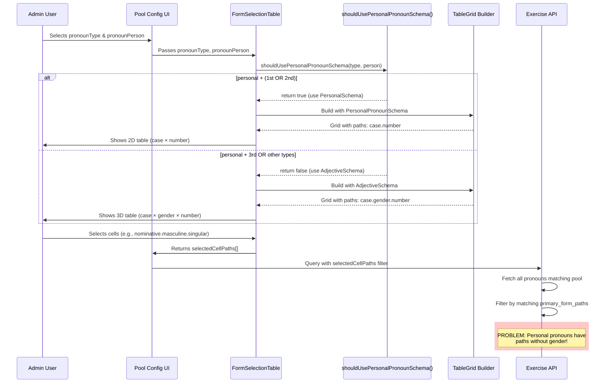
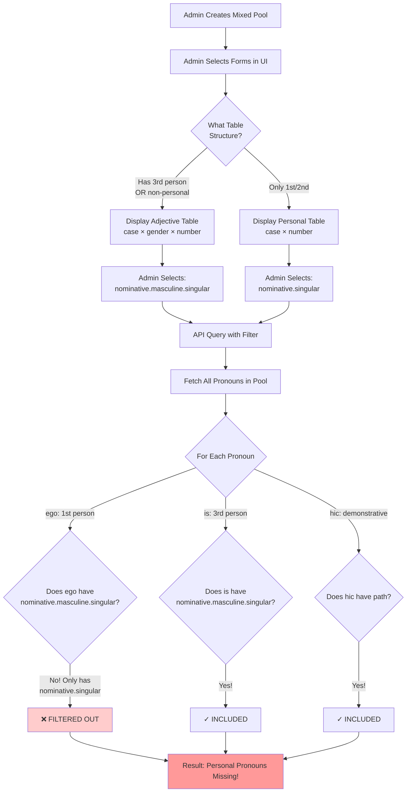
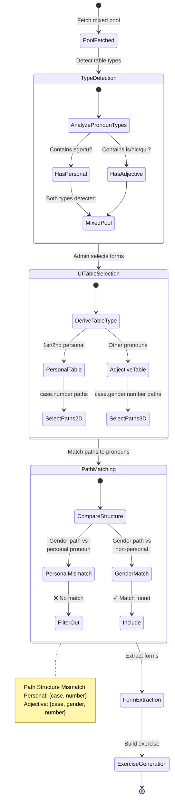

# Pronoun Form Identification Architecture

## Problem Summary

When a vocabulary pool contains **mixed pronoun types** (both personal and non-personal pronouns), the form identification exercise has structural mismatches that cause personal pronouns to be silently excluded from exercises.

## Background: Two Pronoun Table Structures

### Personal Pronouns (1st/2nd person: ego, tu, nos, vos)

**Table Structure**: `PersonalPronounDeclensionTable`
- Organized by: **Case only** (nominative, genitive, dative, accusative, ablative, vocative, locative)
- Each case has: singular and plural arrays
- **No gender dimension**

Example paths: `nominative.singular[0]`, `genitive.plural[1]`

```
nominative: {
  singular: ["ego", "me"],
  plural: ["nos", ...]
}
genitive: {
  singular: ["mei"],
  plural: ["nostrum", ...]
}
```

### Personal Pronouns (3rd person: is, ea, id) & Other Pronouns (demonstrative, relative, etc.)

**Table Structure**: `AdjectiveDeclensionTable`
- Organized by: **Case × Gender** (masculine, feminine, neuter)
- Each gender has: singular and plural arrays
- **Has gender dimension**

Example paths: `nominative.masculine.singular[0]`, `genitive.feminine.plural[1]`

```
nominative: {
  masculine: { singular: ["is"], plural: [...] },
  feminine: { singular: ["ea"], plural: [...] },
  neuter: { singular: ["id"], plural: [...] }
}
```

## Current Architecture

### Form Selection Flow

```
Editor: Admin selects forms in FormSelectionTable
        ↓
pronounType filter & tableType derivation
        ↓
tableType = deriveTableTypeFromPOS('pronoun', pronounType)
```

### Table Type Derivation Logic

```typescript
if (pronounType === 'personal' && (pronounPerson === '1st' || pronounPerson === '2nd')) {
  return 'pronoun-declension'  // PersonalPronounDeclensionTable
} else {
  return 'pronoun-adjective-declension'  // AdjectiveDeclensionTable
}
```

### The Problem: Mixed Pool Scenario

**Pool contains**: ego (1st personal), hic (demonstrative), qui (relative)

**What happens**:
1. When pool is selected, `pronounType` is `'all'` (not filtered)
2. `deriveTableTypeFromPOS(...)` defaults to `'pronoun-adjective-declension'`
3. FormSelectionTable shows **adjective-style paths** (case × gender × number)
4. Admin selects: `nominative.masculine.singular`
5. Exercise fetches words with selected cellPaths: `['pronoun_declension_table.nominative.masculine.singular']`

**What breaks**:
- ego (personal pronoun) has table structure: `pronouns_declension_table.nominative.singular` (NO gender)
- hic (demonstrative) has table structure: `pronoun_adjective_declension_table.nominative.masculine.singular` (HAS gender)
- `pickRandomFormServer()` cannot find `nominative.masculine.singular` in ego's table
- Returns `null` for ego
- Backend filters out ego (no valid form data)
- Result: Personal pronouns silently missing from exercise

## Current Behavior

| Scenario | Result |
|----------|--------|
| Pool = only personal pronouns (1st/2nd) + select gender-specific paths | Personal pronouns filtered out |
| Pool = only non-personal pronouns + select gender-specific paths | Works correctly |
| Pool = mixed pronouns + select case-only paths | Non-personal pronouns might work if they support case-only structure (uncommon) |
| Pool = mixed pronouns + select gender-specific paths | Personal pronouns filtered out |

## Consequences

- Silent data loss (personal pronouns disappear without warning)
- Confusing admin experience (words in pool don't all appear in exercise)
- No validation/warning to the user

## Potential Solutions

### Option 1: Accept Current Behavior (Minimal Code Impact)
- Personal pronouns with gender-specific paths are excluded (arguably correct - they don't have gender)
- Users must create separate pools for personal vs. non-personal pronouns
- Add documentation

### Option 2: Show Warning (Low Code Impact)
- Detect mixed pronoun types in pool
- Warn: "Pool contains personal pronouns without gender. Selected paths with gender won't match personal pronouns."
- Users can choose to: create separate pools, or accept that personal pronouns won't appear

### Option 3: Dual Table Selector (High Code Impact)
- Show both table structures in FormSelectionTable when pool has mixed pronouns
- User manually selects which pronoun types each cell path applies to
- Complex UI, significant refactoring

### Option 4: Automatic Path Separation (Medium Code Impact)
- When fetching exercise words, separate query by pronoun table type
- Create separate selected paths for personal vs. non-personal
- Requires query splitting logic

## Recommendation

**Option 1 (Accept) or Option 2 (Warn)** - Personal pronouns are fundamentally different and arguably should be in separate pools. A warning+documentation approach educates users without major refactoring.

---

## Architecture Diagrams

### 1. Table Structure Comparison

```mermaid
classDiagram
    class PersonalPronounDeclensionTable {
        <<1st/2nd Person: ego, tu>>
        +nominative: {singular, plural}
        +genitive: {singular, plural}
        +dative: {singular, plural}
        +accusative: {singular, plural}
        +ablative: {singular, plural}
        +vocative: {singular, plural}
        +locative: {singular, plural}
    }

    class AdjectiveDeclensionTable {
        <<3rd Person & Other: is, hic, qui>>
        +nominative: {masculine, feminine, neuter}
        +genitive: {masculine, feminine, neuter}
        +dative: {masculine, feminine, neuter}
        +accusative: {masculine, feminine, neuter}
        +ablative: {masculine, feminine, neuter}
        +vocative: {masculine, feminine, neuter}
        +locative: {masculine, feminine, neuter}
    }

    class DeclensionNumberForms {
        +singular: string[]
        +plural: string[]
    }

    class GenderForms {
        +masculine: DeclensionNumberForms
        +feminine: DeclensionNumberForms
        +neuter: DeclensionNumberForms
    }

    PersonalPronounDeclensionTable --> DeclensionNumberForms : case → number
    AdjectiveDeclensionTable --> GenderForms : case → gender → number
    GenderForms --> DeclensionNumberForms : contains 3x

    note for PersonalPronounDeclensionTable "Path: case.number\nExample: nominative.singular"
    note for AdjectiveDeclensionTable "Path: case.gender.number\nExample: nominative.masculine.singular"
```

**Key Insight**: Personal pronouns (1st/2nd person) have 2-level paths, while adjective-like pronouns have 3-level paths. This structural difference is the root cause of the mixed pool problem.

### 2. Form Selection Data Flow



### 3. Mixed Pool Problem



### 4. Processing Pipeline State Diagram



---

## Files Involved

- `/shared/types/vocabulary/schemas/declension.ts` - Schema definitions
- `/shared/types/vocabulary/schemas/pronoun.ts` - Pronoun union type
- `/src/utils/generated/tableType.ts` - Table type derivation logic
- `/src/components/ui/admin/vocabulary/FormSelectionTable.tsx` - UI table selection
- `/src/utils/exercises/formIdentificationHelpers.ts` - Path filtering logic
- `/src/types/api/exercise-word-responses.d.ts` - Form path type definitions

## Summary

The system works correctly for **homogeneous pools** (all same pronoun type) but silently excludes personal pronouns from **mixed pools** (multiple pronoun types). The architectural mismatch between two table structures causes path matching to fail for 1st/2nd person pronouns when gender-based paths are selected.
